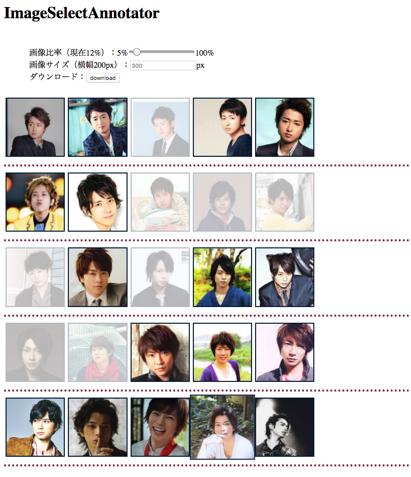

# ImageSelectAnnotator
This is a simple tool when you want to extract a part of images.



## How to use??

1. Put images at [`static/images/`](https://github.com/iwasakishuto/ImageSelectAnnotator/blob/master/static/images/).
```
$ tree static/images/
static/images/
├── Jun_Matsumoto
│   ├── img01.jpg
│   ├── img02.jpg
│   ├── img03.jpg
│   ├── img04.jpg
│   └── img05.jpg
├── Kazunari_Ninomiya
│   ├── img01.jpg
│   ├── img02.jpg
│   ├── img03.jpg
│   ├── img04.jpg
│   └── img05.jpg
```
2. Run the [`img2json.py`](https://github.com/iwasakishuto/ImageSelectAnnotator/blob/master/img2json.py) to make [`main.js`](https://github.com/iwasakishuto/ImageSelectAnnotator/blob/master/static/js/main.js)
3. Open [`index.html`](https://github.com/iwasakishuto/ImageSelectAnnotator/blob/master/templates/index.html)
